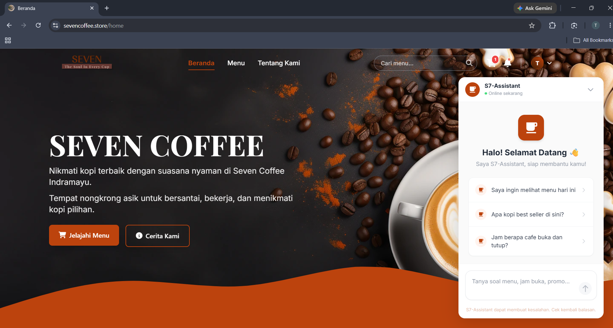
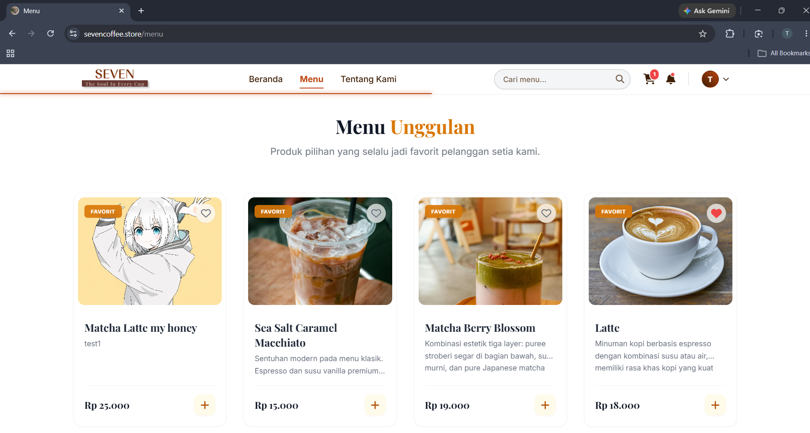
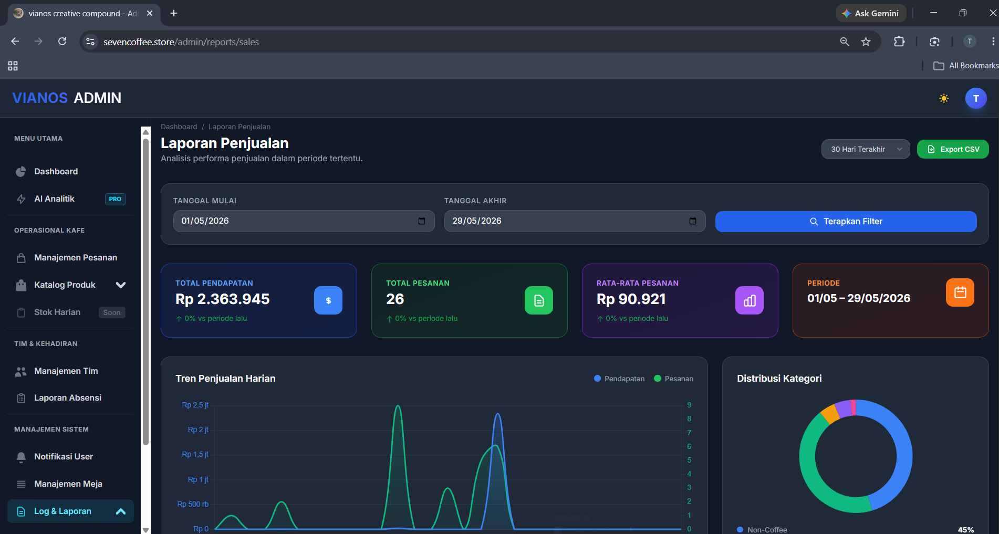

<div align="center">
  <a href="#">
    
  </a>

  <p align="center">
    <strong>Platform pemesanan dan manajemen kafe cerdas dengan analitik AI, dibangun menggunakan Laravel 12.</strong>
  </p>

  <p align="center">
    
    <br>
    
    
    
    
    <br>
    
    
    
    <br>
    
  </p>
</div>

<hr>

## 📖 Tentang Proyek

**Seven Caffee** adalah platform e-commerce dan dashboard manajemen terpadu yang dirancang khusus untuk operasional kafe modern. Lebih dari sekadar aplikasi pemesanan biasa, sistem ini ditenagai oleh Kecerdasan Buatan (AI). Bagi pelanggan, AI akan merekomendasikan menu yang dipersonalisasi. Sementara itu bagi pihak manajemen, fitur **AI Sales Forecasting** tingkat tinggi memungkinkan prediksi pendapatan, pelacakan jam ramai, hingga analisis retensi pelanggan untuk mengoptimalkan profitabilitas bisnis secara strategis.

> [!NOTE]
> **Dokumentasi AI Terdedikasi**: Untuk detail arsitektur teknis lengkap, visualisasi alur Mermaid, detail formula kemiripan (Cosine, Euclidean), system prompt dinamis chatbot, dan skrip pengujian CLI, silakan rujuk ke [Dokumentasi Sistem Kecerdasan Buatan (AI)](docs/README_AI.md).

---

## 📑 Daftar Isi

- [Tentang Proyek](#-tentang-proyek)
- [Status Proyek](#-status-proyek)
- [Fitur Utama](#-fitur-utama)
- [Teknologi yang Digunakan](#-teknologi-yang-digunakan-tech-stack)
- [Struktur Folder](#-struktur-folder)
- [Tangkapan Layar](#-tangkapan-layar)
- [Persyaratan Sistem](#-persyaratan-sistem-rinci)
- [Cara Memulai & Instalasi](#-cara-memulai--instalasi)
- [Kredensial Demo](#-kredensial-demo)
- [Panduan Penggunaan Dasar](#-panduan-penggunaan-dasar)
- [Variabel Lingkungan](#-variabel-lingkungan-environment-variables)
- [Dokumentasi API](#-dokumentasi-api)
- [Machine Learning & Supervisor](#-machine-learning-supervisor--cron-di-produksi)
    - [Konfigurasi Supervisor](#1-konfigurasi-supervisor-etcsupervisorconfdvianos-workerconf)
    - [Cron Job Penjadwal](#2-cron-job-penjadwal-scheduler)
    - [Sistem Rekomendasi Hybrid](#3-sistem-rekomendasi-content-based--collaborative-filtering)
- [Pemecahan Masalah (Troubleshooting)](#-pemecahan-masalah-troubleshooting)
- [Roadmap Proyek](#-roadmap-proyek)
- [Tim Pengembang](#-tim-pengembang)
- [Lisensi](#-lisensi)

---

## 🏷️ Status Proyek

Saat ini proyek berada dalam fase **Beta (v1.0.0-beta)**. Fitur inti telah stabil dan dapat digunakan, namun beberapa optimasi dan fitur tambahan akan terus dikembangkan (Lihat [Roadmap](#-roadmap-proyek)).

---

## ✨ Fitur Utama

Aplikasi ini dibagi menjadi dua antarmuka dengan kapabilitas lengkap untuk pengguna (customer) dan administrator.

### 👨‍💻 Fitur Pelanggan (User)

- **Autentikasi & Akun:** Google SSO (Socialite), verifikasi email & custom reset password, edit profil (avatar upload/hapus), hapus akun.
- **Alamat & Kontak:** Kelola alamat dan nomor telepon untuk pengiriman/konfirmasi.
- **Jelajah Menu & Pencarian:** Daftar menu dengan fitur pencarian, filter kategori, rentang harga, pengurutan (sort), pagination/AJAX lazy-load, menu signature (featured) dan top popular.
- **Keranjang & Checkout:** Tambah item, ubah kuantitas, catatan per-item, hapus item, checkout yang membuat Order + OrderItems, mengurangi stok produk, menghasilkan kode pesanan & nomor antrian.
- **Checkout via WhatsApp:** Opsi checkout yang mengirim ringkasan pesanan ke WhatsApp (terintegrasi dengan `WhatsAppService` dan mencatat `WhatsappLog`).
- **Favorit (Wishlist):** Toggle produk favorit (AJAX) dan halaman daftar favorit.
- **Riwayat Pesanan:** Halaman riwayat pesanan dan detail pesanan untuk setiap pengguna.
- **Notifikasi Pelanggan:** Halaman notifikasi promo & sistem; bisa menandai terbaca, tandai semua terbaca, dan menghapus notifikasi.
- **Chatbot AI (S7-Assistant):** Endpoint `/chatbot/ask` untuk percakapan berbasis Llama (Groq); system prompt menyertakan daftar menu, promo, jam operasional, dan membatasi topik.
- **Halaman Publik:** Beranda, halaman menu publik, dan halaman About.

### 👑 Fitur Panel Admin

- **Dashboard & Statistik:** Dashboard admin dengan API statistik untuk panel dan ringkasan metrik operasional.
- **AI Analitik & Forecasting:** Prediksi pendapatan (RevenuePredictor), prediksi permintaan/restock (DemandForecast), analisis retensi pelanggan, prediksi jam ramai, grafik historis & proyeksi, serta insight strategi yang dapat diambil (opsional via Groq API).
- **Training Model Terjadwal:** `TrainAiModelsJob` dijadwalkan (scheduler) untuk melatih ulang model AI secara berkala; berjalan di queue (butuh worker / Supervisor di produksi).
- **Manajemen Menu & Kategori:** CRUD menu & kategori, soft delete (trash), restore, force-delete (cek dependensi order), bulk actions (delete/restore/force-delete), toggle signature & availability, search & filter API, serta reorder kategori.
- **Manajemen Pesanan:** Daftar pesanan dengan DataTables server-side, update status pesanan & status pembayaran, batalkan pesanan (kembalikan stok), detail pesanan, cetak invoice PDF (DOMPDF), export laporan penjualan (CSV), dan endpoint polling terbaru (`orders.latestId`).
- **Pelaporan & Ekspor:** Laporan penjualan lengkap (harian, periodik, growth), top menus, user activity, dan export CSV.
- **Notifikasi Admin:** Kirim notifikasi promo atau sistem ke semua pengguna atau per-user; tampilan & API DataTables untuk manajemen notifikasi.
- **Manajemen Pengguna:** CRUD user, trash/restore/force-delete, peran (`user`, `admin`, `owner`), toggle aktif/nonaktif, reset password (owner-only actions protected).
- **Audit & Log:** Activity log (audit trail) dengan DataTables, lihat detail, hapus, dan opsi clear-all.
- **Integrasi WhatsApp Log:** Lihat log pesan WhatsApp, retry pengiriman, dan pencatatan status (pending/sent/failed).
- **Pengaturan (Settings):** Pengaturan umum, branding (logo/favikon upload), kontak & media sosial, jam operasional (database + cache) dan endpoint upload gambar.
- **Alat & Integrasi Lainnya:** Integrasi Yajra DataTables (server-side), DOMPDF (invoice), Rubix ML (model), Groq/Llama untuk AI, dan integrasi WhatsApp API.

---

## 💻 Teknologi yang Digunakan (Tech Stack)

### Backend

- **Framework Utama**: Laravel 12.0
- **Bahasa Pemrograman**: PHP 8.2+
- **Machine Learning**: Rubix ML 2.5 & Rubix Tensor
- **Database**: MySQL
- **Ekspor Dokumen**: DOMPDF

### Frontend

- **Desain & Styling**: Tailwind CSS 3 & Flowbite (Mendukung fitur _Dark/Light Mode_)
- **Tipografi**: **Playfair Display** & **Inter** (Desain elegan dengan keterbacaan tinggi)
- **Tabel Data**: DataTables (terintegrasi dengan `yajra/laravel-datatables-oracle`)
- **Interaktivitas JS**: Alpine.js & Custom Toast Notifications
- **Animasi Visual**: AOS (Animate On Scroll)
- **Slider & Galeri**: Swiper & PhotoSwipe
- **Sistem Build**: Vite

---

## 📂 Struktur Folder

Aplikasi ini mengikuti arsitektur direktori standar Laravel yang bersih dan dapat diskalakan:

```text
seven-caffee/
├── app/                  # Logika inti aplikasi (Models, Controllers, ML Jobs)
├── bootstrap/            # Skrip pemuatan aplikasi (App bootstrapping)
├── config/               # Semua file konfigurasi proyek
├── database/             # Migrasi, seeders, dan factories (Database setup)
├── public/               # File publik (index.php) dan aset hasil kompilasi Vite
├── resources/            # Aset mentah (Frontend)
│   ├── css/              # Konfigurasi Tailwind CSS
│   ├── js/               # Logika frontend & komponen Alpine.js
│   └── views/            # File template antarmuka Blade (UI/UX)
├── routes/               # Definisi jalur aplikasi (web.php, api.php)
├── storage/              # File cache, logs, model AI, dan unggahan (uploads)
├── tests/                # File pengujian otomatis (Pest/PHPUnit)
├── .env                  # Variabel lingkungan rahasia
├── composer.json         # Dependensi PHP backend
├── package.json          # Dependensi Node.js frontend
└── tailwind.config.js    # Konfigurasi visual Tailwind CSS
```

---

## 📸 Tangkapan Layar

### 👨‍💻 Antarmuka Pelanggan (Customer Interface)

| Halaman Utama & Rekomendasi AI | Jelajah Menu & Interaksi |
| :---: | :---: |
|  |  |
| _Tampilan modern, responsif, ditenagai rekomendasi menu pintar._ | _Pencarian, filter kategori instan, dan antarmuka pemesanan cepat._ |

### 👑 Antarmuka Administrator (Admin Panel)

| Dashboard Analitik & Sales Forecasting AI |
| :---: |
|  |
| _Visualisasi data lengkap, prediksi pendapatan, ramalan permintaan, serta rekomendasi keputusan berbasis AI._ |

---

## ⚙️ Persyaratan Sistem Rinci

Pastikan server atau komputer Anda memenuhi spesifikasi minimum berikut:

- **PHP**: Versi `8.2` atau lebih tinggi.
- **Ekstensi PHP Wajib**: `Ctype`, `cURL`, `DOM`, `Fileinfo`, `Filter`, `Hash`, `Mbstring`, `OpenSSL`, `PCRE`, `PDO`, `Session`, `Tokenizer`, `XML`.
- **Database**:
    - MySQL versi `8.0+`
    - MariaDB versi `10.3+`
    - PostgreSQL versi `12+`
- **Node.js**: Versi `18+` (dengan `npm` atau `yarn`).
- **Composer**: Versi `2.x`.

---

## 🚀 Cara Memulai & Instalasi

Ikuti instruksi berikut untuk menjalankan proyek ini secara lokal.

1. **Unduh (Clone) repositori**:

    ```bash
    git clone https://github.com/ivan-4k/proyek3-vianos-creative-compound.git
    cd proyek3-vianos-creative-compound
    ```

2. **Instalasi Dependensi PHP & Node**:

    ```bash
    composer install
    npm install
    ```

3. **Konfigurasi Lingkungan**:
   Salin file konfigurasi lalu _generate_ kunci aplikasi.

    ```bash
    cp .env.example .env
    php artisan key:generate
    ```

4. **Jalankan Migrasi & Data Palsu (Seeder)**:
   Pastikan konfigurasi database di file `.env` sudah benar, lalu jalankan perintah ini:

    ```bash
    php artisan migrate --seed
    ```

5. **Mulai Server Pengembangan Lokal**:
    ```bash
    composer run dev
    ```

---

## 🔑 Kredensial Demo

Jika Anda telah menjalankan `php artisan migrate --seed`, Anda dapat masuk ke panel admin menggunakan kredensial bawaan berikut:

- **URL Login**: `http://localhost:8000/login`
- **Email Admin**: `admin@vianos.com` _(Atau sesuaikan dengan email dari DatabaseSeeder)_
- **Password**: `password`

---

## 📖 Panduan Penggunaan Dasar

Bagian ini ditujukan untuk dosen penguji, klien, atau staf operasional non-developer:

1. **Melihat Menu & Memesan**: Buka `http://localhost:8000`. Login menggunakan akun Google Anda. Lihat rekomendasi AI, klik tombol _Favorite_ pada menu yang disukai, lalu masukkan ke dalam Keranjang Belanja untuk _checkout_.
2. **Masuk ke Dashboard Admin**: Akses `/login` dengan kredensial admin.
3. **Melihat Prediksi Penjualan**: Arahkan ke menu **AI Sales Forecasting** untuk melihat prediksi jam sibuk, estimasi pendapatan, dan tingkat pelanggan yang kembali.
4. **Chat Bot**: Gunakan widget asisten AI di pojok layar admin untuk menganalisa data dengan _prompt_ instan.
5. **Pengaturan Identitas**: Di menu "Pengaturan Caffee", Anda dapat mengubah logo, nama kafe, dan jam operasional.

---

## 🌐 Variabel Lingkungan (Environment Variables)

Proyek ini membutuhkan beberapa variabel lingkungan khusus di dalam `.env` agar fitur kecerdasan buatan dapat berfungsi:

```env
# Kunci API untuk Chatbot dan Prediksi Lanjutan (Llama 3.1 / Groq)
# Dapatkan gratis di: https://console.groq.com/
GROQ_API_KEY="your_groq_api_key_here"

# Autentikasi Google Login untuk Pelanggan (Socialite)
GOOGLE_CLIENT_ID=...
GOOGLE_CLIENT_SECRET=...
```

---

## 🔌 Dokumentasi API

Jika diperlukan integrasi ke aplikasi _mobile_ di masa mendatang, proyek ini menyediakan titik akses (Endpoints) API standar Laravel (`routes/api.php`). Autentikasi _bearer token_ (jika diaktifkan) menggunakan Laravel Sanctum.

- Endpoint Publik: `GET /api/menu`, `GET /api/promos`
- Pengujian API dapat menggunakan perangkat lunak seperti **Postman** atau **Insomnia**.

---

## 🧠 Machine Learning, Supervisor & Cron di Produksi

Fitur _Machine Learning_ (Rubix ML) memerlukan _queue worker_ (pekerja antrean) yang stabil agar tidak membebani pemuatan halaman (HTTP Request). Pada **server produksi (VPS)**, Anda harus menggunakan **Supervisor** untuk menjaga antrean tetap hidup selamanya.

### 1. Konfigurasi Supervisor (`/etc/supervisor/conf.d/vianos-worker.conf`)

Buat file konfigurasi Supervisor agar `queue:work` berjalan permanen di _background_:

```ini
[program:vianos-worker]
process_name=%(program_name)s_%(process_num)02d
command=php /var/www/proyek3-vianos-creative-compound/artisan queue:work --sleep=3 --tries=3 --max-time=3600
autostart=true
autorestart=true
stopasgroup=true
killasgroup=true
user=www-data
numprocs=1
redirect_stderr=true
stdout_logfile=/var/www/proyek3-vianos-creative-compound/storage/logs/worker.log
stopwaitsecs=3600
```

Lalu jalankan:

```bash
sudo supervisorctl reread
sudo supervisorctl update
sudo supervisorctl start vianos-worker:*
```

### 2. Cron Job Penjadwal (Scheduler)

Untuk melatih ulang AI secara otomatis dan tugas periodik lainnya, tambahkan baris berikut di konfigurasi Cron server Anda (`crontab -e`):

```bash
* * * * * cd /var/www/proyek3-vianos-creative-compound && php artisan schedule:run >> /dev/null 2>&1
```

### 3. Sistem Rekomendasi (Content-Based + Collaborative Filtering)

Platform Seven Caffee menggunakan **hybrid recommendation system** yang menggabungkan dua pendekatan machine learning untuk memberikan rekomendasi menu yang paling relevan kepada setiap pengguna.

#### 📊 Arsitektur Sistem Rekomendasi

```
┌─────────────────────────────────────────────────────────────┐
│          User Interacts (Browse, Add to Cart, Order)       │
└────────────────────┬────────────────────────────────────────┘
                     │
        ┌────────────┴────────────┐
        │                         │
        ▼                         ▼
┌─────────────────────┐  ┌──────────────────────┐
│  Content-Based      │  │  Collaborative       │
│  Filtering (CBF)    │  │  Filtering (CF)      │
│                     │  │                      │
│ Features:           │  │ User-to-User         │
│ • Category          │  │ Similarity:          │
│ • Price             │  │ • Cosine Distance    │
│ • Is Signature      │  │ • Purchase History   │
│ • Popularity        │  │ • Similar Users      │
│                     │  │                      │
│ Distance: Euclidean │  | Distance: Cosine     │
│ Kernel              │  │ Kernel               │
└──────────┬──────────┘  └──────────┬───────────┘
           │                        │
           └────────────┬───────────┘
                        │
              ┌─────────▼──────────┐
              │   Rank & Merge     │
              │   Recommendations  │
              │   (Top 6)          │
              └─────────┬──────────┘
                        │
              ┌─────────▼──────────┐
              │   Exclude Filter   │
              │  • Already bought  │
              │  • Already marked  │
              │    as favorite     │
              └─────────┬──────────┘
                        │
              ┌─────────▼──────────┐
              │   Return Final     │
              │   Recommendations  │
              │   (Up to 6 items)  │
              └────────────────────┘
```

#### 🔧 Komponen Teknis

**1. Content-Based Filtering (`ContentBasedRecommender.php`)**

Menggunakan Rubix ML's `ZScaleStandardizer` untuk normalisasi fitur produk:

| Fitur          | Tipe    | Sumber                      | Fungsi                      |
| -------------- | ------- | --------------------------- | --------------------------- |
| `category_id`  | Integer | `products.id_kategori`      | Klasifikasi kategori produk |
| `price`        | Float   | `products.price`            | Harga relatif produk        |
| `is_signature` | Boolean | `products.is_signature`     | Produk unggulan/signature   |
| `popularity`   | Float   | SUM(`order_items.quantity`) | Jumlah unit terjual         |

**Alur:**

```php
// 1. Fetch raw features dari semua produk
$productRawMap = $recommender->getProductRawFeatures();

// 2. Build user taste profile dari purchase history (weighted average)
$userProfile = average($purchaseHistory entries * quantity weight);

// 3. Compute Euclidean distance dari user profile ke semua produk
$distances = euclidean_distance($userProfile, normalized_product_features);

// 4. Return top-6 produk terdekat (paling mirip selera user)
$topRecommendations = sort_by_distance($distances)->take(6);
```

**2. Collaborative Filtering (`CollaborativeFilteringRecommender.php`)**

Menggunakan user-to-user similarity berbasis purchase history:

| Aspek               | Deskripsi                                                                      |
| ------------------- | ------------------------------------------------------------------------------ |
| **User Vector**     | Array purchase quantities per produk: `[qty_prod1, qty_prod2, ..., qty_prodN]` |
| **Normalization**   | ZScaleStandardizer (sama seperti CBF)                                          |
| **Distance Kernel** | Cosine (mengukur sudut similarity, lebih cocok untuk sparse vectors)           |
| **Similar Users**   | Top-k users dengan cosine similarity tertinggi                                 |
| **Recommendation**  | Produk yang dibeli similar users tapi belum dibeli current user                |

**Alur:**

```php
// 1. Normalize user purchase vector
$userNorm = normalize($userRawVector);

// 2. Compute cosine similarity dengan semua user lain
$similarities = [];
foreach (all_users as $otherUser) {
    $similarity = cosine_kernel($userNorm, other_user_norm);
    $similarities[$otherUser] = $similarity;
}

// 3. Get top-5 most similar users
$similarUsers = sort_by_similarity($similarities)->take(5);

// 4. Aggregate products dari similar users
// (weighted by similarity score)
$productScores = aggregate_products($similarUsers);

// 5. Return top-6 products
$topRecommendations = sort_by_score($productScores)->take(6);
```

**3. Personalisasi Menu Populer (K-Means Clustering)**

Menggunakan algoritma K-Means Clustering untuk mengelompokkan pengguna berdasarkan pola pembelian mereka. Sistem membaca jumlah pembelian per-kategori produk untuk setiap user, lalu membentuk kluster. Pada halaman "Sedang Populer", pengguna akan melihat menu yang paling laris (trending) *hanya* di dalam klusternya, memberikan pengalaman tren yang jauh lebih relevan ("Disarankan Untukmu").

| Aspek               | Deskripsi                                                                      |
| ------------------- | ------------------------------------------------------------------------------ |
| **User Features**   | Jumlah pembelian produk untuk setiap kategori (`id_kategori`)                  |
| **Algoritma**       | K-Means Clustering (Rubix ML)                                                  |
| **Fallback**        | Jika user belum masuk kluster, tampilkan menu terpopuler secara global         |
| **Artisan Command** | `php artisan ai:cluster-users` (disimpan pada kolom `cluster_id` di tabel users) |

#### 🔄 Training Pipeline

Semua model di-train secara **otomatis dan berkala** melalui Laravel Scheduler + Queue:

```php
// routes/console.php
Schedule::command('ai:cluster-users')->dailyAt('00:00');
Schedule::job(new TrainAiModelsJob())->weekly()->mondays()->at('01:00');
Schedule::job(new TrainRecommenderJob())->weekly()->mondays()->at('02:00');
Schedule::job(new TrainCollaborativeFilteringJob())->weekly()->mondays()->at('03:00');
```

**TrainRecommenderJob (Content-Based):**

- Fetch semua produk available
- Hitung popularity dari total quantity sold per produk
- Fit ZScaleStandardizer pada feature matrix
- Persist normalized vectors + scaling parameters ke `storage/app/ai-models/recommender_data.json`

**TrainCollaborativeFilteringJob (Collaborative):**

- Fetch semua users dengan completed orders
- Build user-product purchase matrix
- Fit ZScaleStandardizer pada matrix
- Persist normalized vectors ke `storage/app/ai-models/collaborative_data.json`

**TrainAiModelsJob (Revenue Predictor & Demand Forecast):**

- Mengambil data transaksi harian 6 bulan terakhir.
- Melatih model Ridge Regression (`RevenuePredictor`) untuk memprediksi pendapatan harian/bulanan.
- Melatih model Ridge Regression (`DemandForecast`) untuk setiap produk aktif guna memprediksi volume penjualan harian 30 hari ke depan dan menghitung sisa waktu sebelum stok habis (*burn-rate*).
- Menyimpan model biner ke `storage/app/ai-models/revenue.model` dan `storage/app/ai-models/demand_{productId}.model`.

#### 🎯 Alur Rekomendasi pada User

Ketika user membuka halaman `/recommendation`:

```
1. Query purchase history dari database
   SELECT id_produk, SUM(quantity) FROM order_items
   WHERE user_id = ? AND order_status = 'completed'
   GROUP BY id_produk

2. Query favorites (untuk exclude)
   SELECT id_produk FROM favorites WHERE user_id = ?

3. Load & use Content-Based Model
   - Build weighted user profile dari purchase history
   - Compute distances ke semua produk
   - Get top-6 recommendations

4. If (recommendations < 6 && model exists):
   Load & use Collaborative Filtering Model
   - Find top-5 similar users
   - Get products from similar users
   - Merge dengan recommendations sebelumnya

5. If (recommendations < 6):
   Fallback ke trending/popular products
   - Sort by is_signature, then by sold_count

6. Final Filter:
   - Remove already purchased
   - Remove already favorited
   - Return final 6 items

7. Pass to view with algorithm flag:
   - 'hybrid' (Content + Collaborative)
   - 'collaborative' (CF only)
   - 'content-based' (CBF only)
   - 'trending' (no ML)
```

#### 🏪 API & Controller

**Controller: `RecommendationController.php`**

```php
// GET /recommendation
public function index()
{
    // Returns recommendations dengan variabel:
    // - $recommendations: Collection[Product] (max 6)
    // - $usedMl: bool (apakah pakai ML)
    // - $algorithm: 'hybrid'|'collaborative'|'content-based'|'trending'
    // - $userFavoriteIds: array (untuk UI heart toggle)
    // - $hasHistory: bool (user punya purchase history?)
}
```

**View: `resources/views/user/recommendation.blade.php`**

- Header dengan badge menunjukkan algoritma yang dipakai
- 6-card grid layout dengan product image, name, description, price
- Favorite toggle (AJAX POST ke `/user/favorite/toggle`)
- Empty state dengan CTA ke menu jika user belum pernah pesan

#### 📈 Data Storage

Kedua model menyimpan state ke JSON files:

```
storage/app/ai-models/
├── recommender_data.json          # Content-Based model
│   ├── means: [mean per feature]
│   ├── stds: [std per feature]
│   ├── entries: [normalized vectors per product]
│   └── product_ids: [ordered product IDs]
│
└── collaborative_data.json         # Collaborative model
    ├── means: [mean per product]
    ├── stds: [std per product]
    ├── entries: [{user_id, raw, norm}, ...]
    └── product_ids: [ordered product IDs]
```

#### ⚙️ Manual Training (Update Model)

Jika Anda menambah produk baru atau ingin memperbarui model AI dengan data transaksi terbaru secara manual, gunakan perintah berikut di terminal:

```bash
php artisan tinker
```

Lalu jalankan perintah ini di dalam Tinker:

```php
// Update Model Rekomendasi (Content-Based)
App\Jobs\TrainRecommenderJob::dispatch();

// Update Model Collaborative Filtering
App\Jobs\TrainCollaborativeFilteringJob::dispatch();

// Update Model Menu Populer Personalisasi (K-Means)
Artisan::call('ai:cluster-users');

// Update Model Prediksi Penjualan & Stok (Opsional)
App\Jobs\TrainAiModelsJob::dispatch();
```

> [!NOTE]
> Secara default, sistem sudah dijadwalkan untuk melakukan training otomatis setiap **Senin pukul 01:00 - 03:00 pagi**.

#### 🧪 Testing & Validation

Tersedia dua skrip pengujian untuk memverifikasi kesehatan model AI:

1.  **Simple Test** (Fokus pada Content-Based):
    ```bash
    php test_recommender.php
    ```

2.  **Comprehensive Test** (Rekomendasi Lengkap & Data Nyata):
    ```bash
    php test_recommender_comprehensive.php
    ```

**Perbedaan Utama:**
- `test_recommender.php`: Digunakan untuk verifikasi cepat apakah file model JSON bisa dibaca dan diproses oleh Rubix ML.
- `test_recommender_comprehensive.php`: Menguji kedua model (Content-Based & Collaborative) menggunakan data asli dari database, mensimulasikan profil pengguna, dan menampilkan output yang lebih detail.

#### 📊 Hybrid Strategy Comparison

| Aspek           | Content-Based            | Collaborative             | Hybrid      |
| --------------- | ------------------------ | ------------------------- | ----------- |
| **Accuracy**    | Moderat                  | Tinggi (jika user banyak) | Tertinggi   |
| **Cold Start**  | ✅ Baik (produk baru OK) | ❌ Buruk (user baru)      | ✅ Baik     |
| **Scalability** | ✅ Fast                  | ⚠️ O(users²)              | ✅ Moderate |
| **Serendipity** | ❌ Predictable           | ✅ Diverse                | ✅ Balanced |
| **Best For**    | New products             | Established users         | Production  |

Sistem ini menggunakan **Hybrid Approach** untuk mendapat manfaat dari keduanya!

---

## 🛠️ Pemecahan Masalah (Troubleshooting)

Berikut adalah 5 masalah (error) yang paling sering ditemui saat menjalankan proyek dan solusinya:

1. **Error: `Vite manifest not found` atau halaman tampil tanpa CSS**
    - _Penyebab_: Aset _frontend_ belum di-build.
    - _Solusi_: Buka terminal, lalu jalankan `npm run dev` (untuk _development_) atau `npm run build` (untuk _production_).

2. **Error: `No application encryption key has been specified` atau `500 Server Error`**
    - _Penyebab_: File `.env` belum memiliki `APP_KEY`.
    - _Solusi_: Jalankan perintah `php artisan key:generate` di terminal.

3. **Error: AI Model gagal ditraining / `Allowed memory size of X bytes exhausted`**
    - _Penyebab_: Operasi _Machine Learning_ (Rubix ML) memakan RAM yang cukup besar.
    - _Solusi_: Tingkatkan batas memori di file `php.ini` server Anda (misal `memory_limit = 512M` atau `-1`).

4. **Error: `cURL error 60: SSL certificate problem: unable to get local issuer certificate`**
    - _Penyebab_: Modul PHP di lokal (biasanya di Windows/XAMPP/Laragon) tidak bisa memverifikasi sertifikat SSL dari API eksternal (Google OAuth / Groq API).
    - _Solusi_: Unduh file `cacert.pem` dari situs resmi cURL, lalu arahkan _path_ `curl.cainfo` di file `php.ini` Anda ke file tersebut.

5. **Error: `SQLSTATE[HY000] [1049] Unknown database`**
    - _Penyebab_: Database MySQL belum dibuat secara manual.
    - _Solusi_: Buka aplikasi database Anda (phpMyAdmin/DBeaver), buat database, lalu jalankan ulang `php artisan migrate`.

---

## 🗺️ Roadmap Proyek

Berikut adalah beberapa fitur yang direncanakan untuk pengembangan ke depannya:

- [ ] **Integrasi Payment Gateway**: Mendukung pembayaran pesanan QRIS otomatis via Midtrans/Xendit.
- [ ] **Aplikasi Mobile PWA**: Menjadikan _website_ pelanggan lebih reaktif dan bisa diinstal sebagai aplikasi _Progressive Web App_.
- [ ] **Ekspor Data Ekstensif**: Laporan analitik ke dalam format Excel (.xlsx) dan CSV.
- [ ] **AI Deskripsi Produk Otomatis**: Menggunakan AI untuk membuat deskripsi produk secara otomatis di fitur admin.
- [ ] **AI Rekomendasi Menu Berdasarkan Cuaca**: Menggunakan AI untuk membuat rekomendasi menu berdasarkan cuaca.
- [ ] **AI Pesan Otomatis Whatsapp**: Pengiriman pesan otomatis via Whatsapp ke pelanggan.

---

## 👥 Tim Pengembang

Proyek ini dikembangkan secara kolaboratif. Jika Anda memiliki pertanyaan, saran, atau peluang diskusi, silakan kunjungi profil GitHub kami:

- [Tino](https://github.com/TinoNurcahya)
- [Ivan](https://github.com/ivan-4k)
- [Rifky](https://github.com/rifkyprasetya)
- [Andika](https://github.com/dikarajadirot)

---

## 📝 Lisensi

Aplikasi ini didistribusikan di bawah **Lisensi MIT**.

---

<div align="center">
  <i>Dikembangkan dengan ❤️ untuk Seven Caffee</i>
</div>
